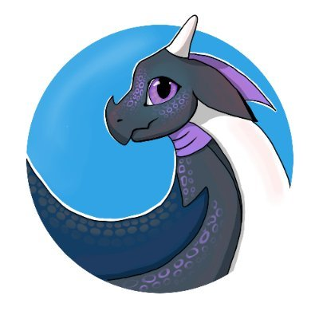
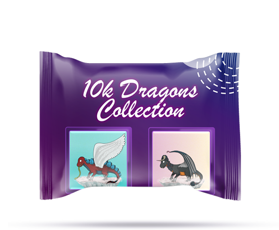

# Babyquick

The first reflection-token in Polygon that reflects 7% to QUICK. Invest in a high potential token that reflects a high potential token in the blockchain with bigger potential. Win-Win-Win.

| Token name               | babyquick                                  |
| ------------------------ | ------------------------------------------ |
| Ticker Symbol            | BABYQUICK                                  |
| Starting Price at launch | $0.0000000012                              |
| Liquidity status         | 100% Locked                                |
| Launch date              | 3th August 18:00 UTC                       |
| Contract                 | 0x9a05D1FF699ea187Dc8523E333eD63503f0d82db |

    <a href="https://quickswap.exchange/#/swap?outputCurrency=0x9a05D1FF699ea187Dc8523E333eD63503f0d82db">
        💳 Buy
    </a> 
    •
    <a href="https://nomics.com/assets/babyquick-babyquick">
        📈 Chart
    </a> 
    •
    <a href="https://secureservercdn.net/160.153.137.40/e83.325.myftpupload.com/wp-content/uploads/2021/11/BABYQUICK-Whitepar.pdf">
        📝 Whitepaper
    </a>

## Why invest in babyquick?

-   We support **Polygon**
    -   With our <a href="https://babyquick.app/polygon/">Double Faucet
        </a> you get rewarded in both Matic and babyquick just for joining this amazing platform with ridiculously low fees.
-   Rewards **Quick**
    -   Just hold your babyquick tokens and you will get a part of our amazing 7% rewards. Enjoy our community and earn Quick day by day.
    -   Reinvest your Quick into BQ and you will leverage your position; that´s the key to make yourself a whale.
-   Developing a **game**
-   **NFT** Collection

## Roadmap

August 2021

-   Stealth Launch and getting our first members.
-   Guerrilla Marketing. Listing in Coinhunt, Coinvote, CoinSniper. Professional Shilling. Shilling and Twitter Contest.
-   Embassador Program. We will be helping people from BSC to understand and move to Polygon Network

Septemper 2021

-   Website Update to 2.0
-   Guerrilla Marketing Ads Campaigns + Influencers Shilling and Twittter contests, CG Submission.

November 2021

-   babyquick game launch on Steam!

## NFT Collection

We are working on a handmade collection of Dragons. Which means we are not using any kind of library, nor vectors just pure art in a unique style.
NFT will be launched one a clear buying pressure allows the investors or holders of the NFT the deserved volume for the collection.

-   10,000 Dragons in total
-   7,000 Earth Dragons
-   2,000 Sea Dragons
-   1,000 Undead or Dark Dragons

<a href="https://t.me/babyquickannouncements/86">More info</a>

## Socials

    <a href="#">🖥️ Website</a> •
    <a href="#">✉️ Telegram</a> •
    <a href="#">🐦 Twitter</a> •
    <a href="#">💬 Reddit</a>

